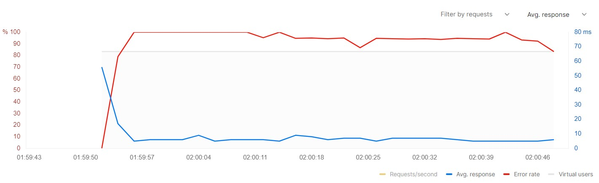

# rate-limiter
An API rate limiter plays a crucial role in constructing an API or a large-scale distributed system, aiding in traffic throttling based on user activity. They enable you to maintain control, ensuring that the service isn't overwhelmed by one or more users, whether intentionally or unintentionally, preventing potential disruptions.

## Table of Contents
- [Local Setup](#LocalSetup)
- [Popular rate limiting algorithms](#PopularRateLimitingAlgorithms)
- [Results and Plots](#Results)

## LocalSetup

```sh
python -m venv venv
venv\Scripts\activate.bat
pip install poetry
cd rate_limiter
poetry install
```

## PopularRateLimitingAlgorithms

## 1. Token Bucket

### Description
- Tokens are added to a bucket at a fixed rate. Each request consumes a token, and if no tokens are available, the request is either delayed or rejected.

### Advantages
- Allows for bursty traffic by accommodating short-term exceeding of the rate limit.
- Smoothens out traffic flow over time.

### Disadvantages
- Can allow bursts that exceed server capacity if the bucket size is too large.

### When to Use
- Ideal for applications that need to handle bursty traffic while maintaining a limit over the long term.

## 2. Leaky Bucket

### Description
- Requests fill a bucket at the rate they arrive. The bucket leaks at a steady rate, processing or dropping requests. If the bucket overflows, incoming requests are discarded.

### Advantages
- Ensures a steady output rate, preventing bursts of traffic from overwhelming the system.

### Disadvantages
- Not flexible for handling bursts of traffic since it enforces a strict output rate.

### When to Use
- Suitable for applications requiring a strict, steady rate of request processing, with minimal tolerance for bursts.

## 3. Fixed Window Counter

### Description
- Counts requests in a fixed time window. If the count exceeds the limit, further requests within that window are blocked.

### Advantages
- Simple to implement and understand.
- Effective at preventing long-term traffic overload.

### Disadvantages
- Can allow twice the rate limit of requests at the boundary of two windows.

### When to Use
- Good for use cases where simplicity and performance are more important than precision in rate limiting.

## 4. Sliding Window Log

### Description
- Records timestamps of each request in a log. The system then counts requests in the window ending at the current time to decide if a new request exceeds the rate limit.

### Advantages
- Offers precise control over request rates by accounting for the exact timing of requests.
- Prevents the boundary issue seen in fixed windows.

### Disadvantages
- Requires more storage and computational resources to maintain and evaluate the log.

### When to Use
- Best for applications where precise rate limiting is crucial and resources are available to handle the overhead.

## 5. Sliding Window Counter

### Description
- Combines the fixed window counter's simplicity with the sliding window's precision by incrementing counters in two consecutive windows and calculating the allowed request count based on the overlap with the current time.

### Advantages
- More efficient than a sliding window log in terms of storage and computation.
- Avoids the boundary issue of fixed windows while being simpler than a full log.

### Disadvantages
- Less precise than the sliding window log and can be more complex to implement than fixed windows.

### When to Use
- Ideal for services that require a balance between precision and resource efficiency in rate limiting.


## Results

Token bucket rate limiting with capacity of 10 tokens with new tokens added at a rate of 1 token per second.


Leaky bucket rate limiting with capacity of 10 tokens with new tokens added at a rate of 1 token per second.


Fixed window counter rate limiting with 10 requests allowed per window size of 20 seconds.


Sliding window log rate limiting with 10 requests allowed per window size of 20 seconds.


Sliding window counter rate limiting with 10 requests allowed per window size of 20 seconds.


